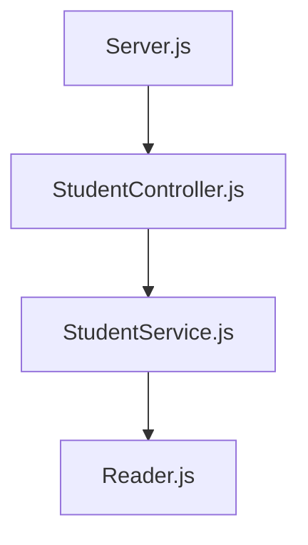
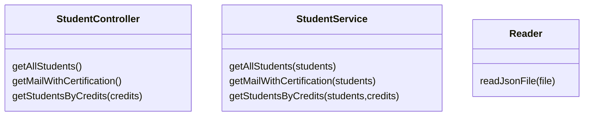

# Diseño de componentes

Similar al ejercicio anterior, se utiliza la misma estructura o flujo en la programación.
La clase Server, se encarga de recibir las peticiones y procesarlas utilizando la clase StudentController. Esta a su vez, manda a llamar al control StudentService desde el cual se utiliza la utilidad Reader para obtener de la base de datos (en formato JSON), la informacion de los estudiantes.

Para cumplir los requerimientos se diseñaron 3 clases

## StudentController

- static getAllStudents() .- Obtiene la lista de todos los estudiantes.
- static getMailWithCertification() .- Obtiene la lista de correos de los estudiantes con certificacion (haveCertification).
- static getStudentsByCredits(credits) .- Obtiene la lista de estudiantes con creditos mayores a *credits*.

## StudentService

- static getAllStudents(students) .- Obtiene la lista de todos los estudiantes del arreglo de objeto *students*.
- staticgetMailWithCertification(students) .- Obtiene la lista de correos de los estudiantes con certificacion (haveCertification) del arreglo de objeto *students*.
- static getStudentsByCredits(students,credits) .- Obtiene la lista de estudiantes con creditos mayores a *credits* del arreglo de objeto *students*.

## Reader

- static readJsonFile .- Lee un archivo JSON y regresa los datos en un objeto para poder ser consultado.

# Dependencias

* JEST --> Usada para pruebas unitarias
* Eslint --> Usada para corrección de estilo en el código
* Express --> Usada para levantar el server

# End points

- *localhost:3000/v1/students* : Lista la información completa de todos los estudiantes.
- *localhost:300/v1/studentsCertificated* : Lista los correos de los alumnos certificados.
- *localhost:300/v1/studentsWithCredits* : Lista la información completa de los alumnos que tengan mas de 500 créditos.
